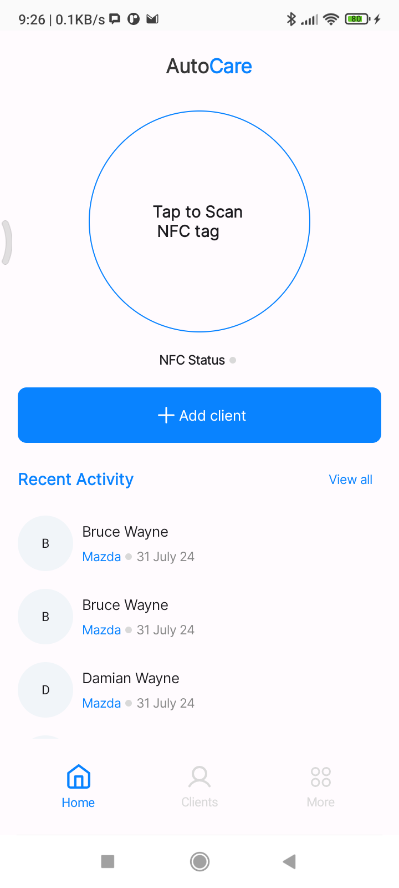
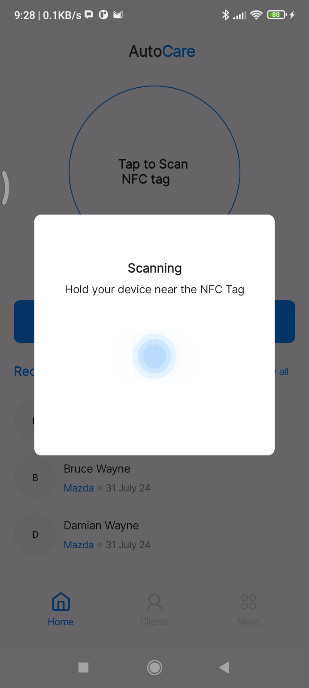
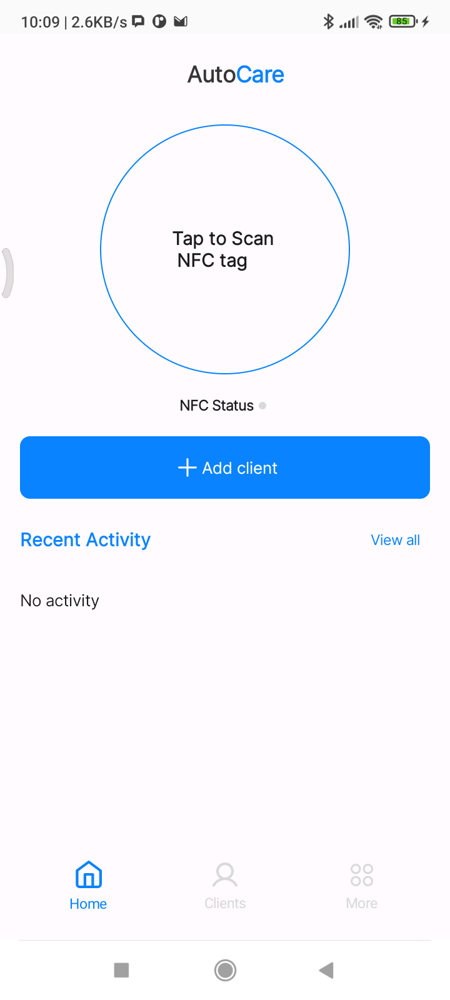
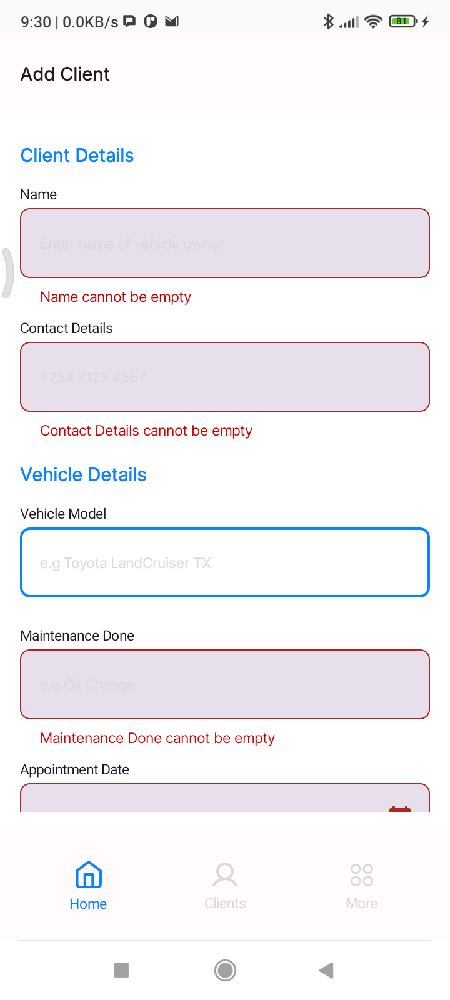
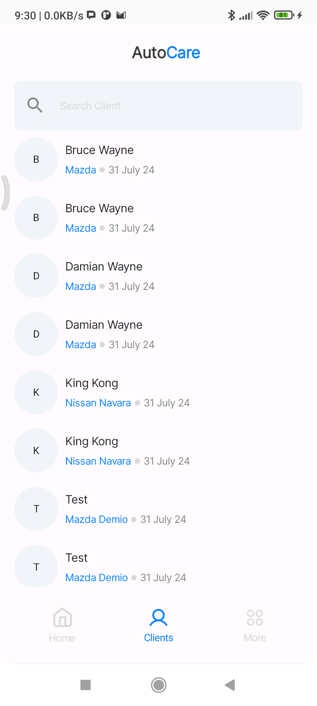
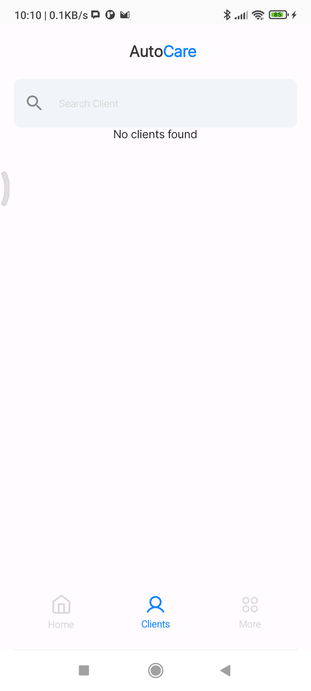
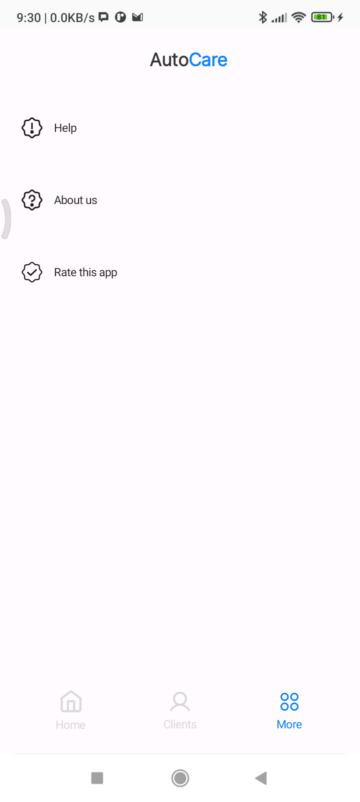

# AutoCareTag
This is an Android application that helps in the process of logging, tracking and managing vehicle maintenance.

## Features
- Write vehicle information to NFC Tags.
- Read vehicle information from NFC Tags.

## Getting Started
### Prerequisites
- Android device with NFC capability

### Installation
1. Clone the repository:
```bash
git clone https://github.com/slowburn-404/AutoCareTag.git
```
```bash
cd AutoCareTag/
```

## Contribution
Use the following [guidelines](./CONTRIBUTION.md).

## Screenshots










## License
This project is licensed under the Apache 2.0 License - see [LICENSE](./LICENSE) file for details.

## Contact
For questions and inquiries, please contact borisochola32@gmail.com
